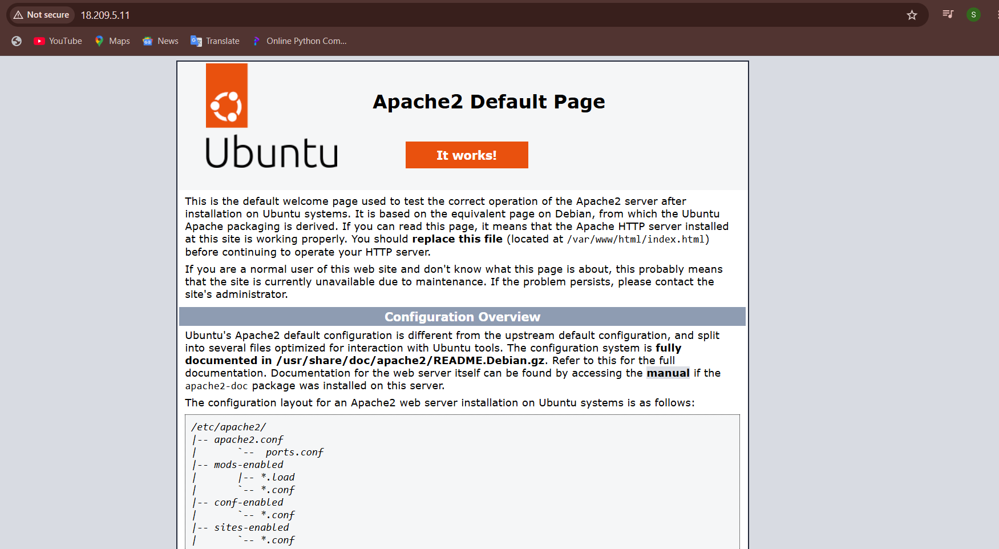
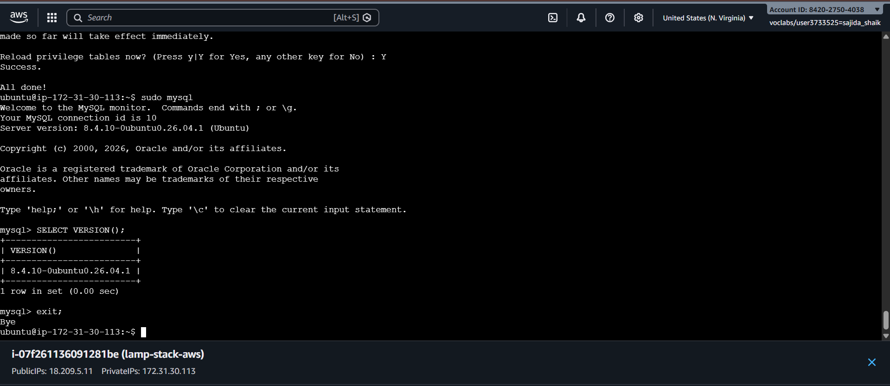
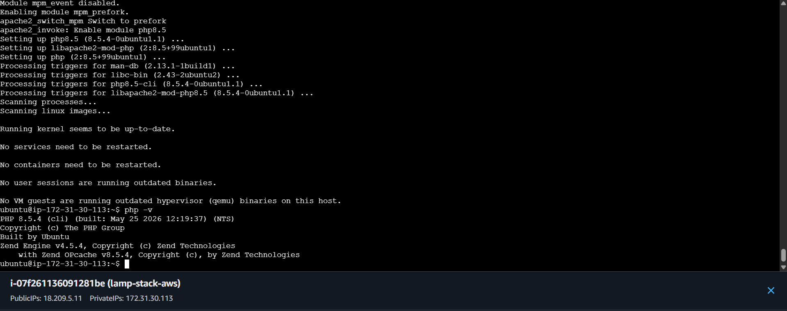
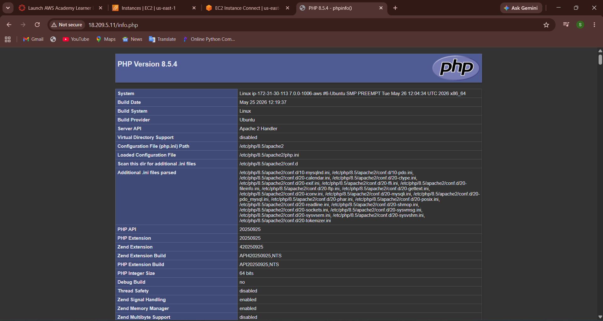
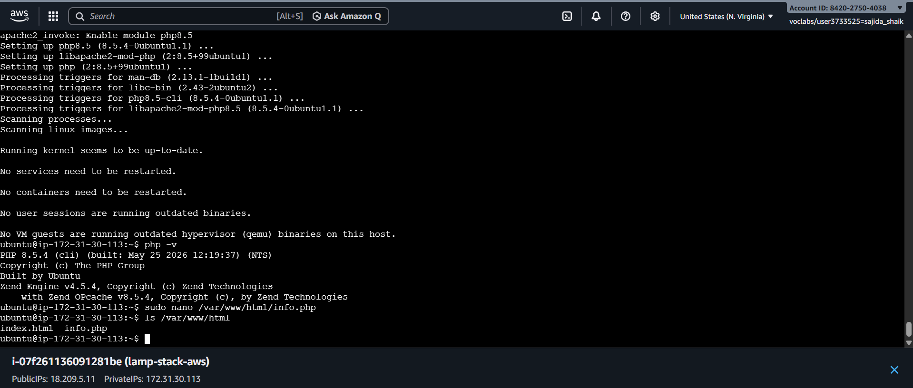
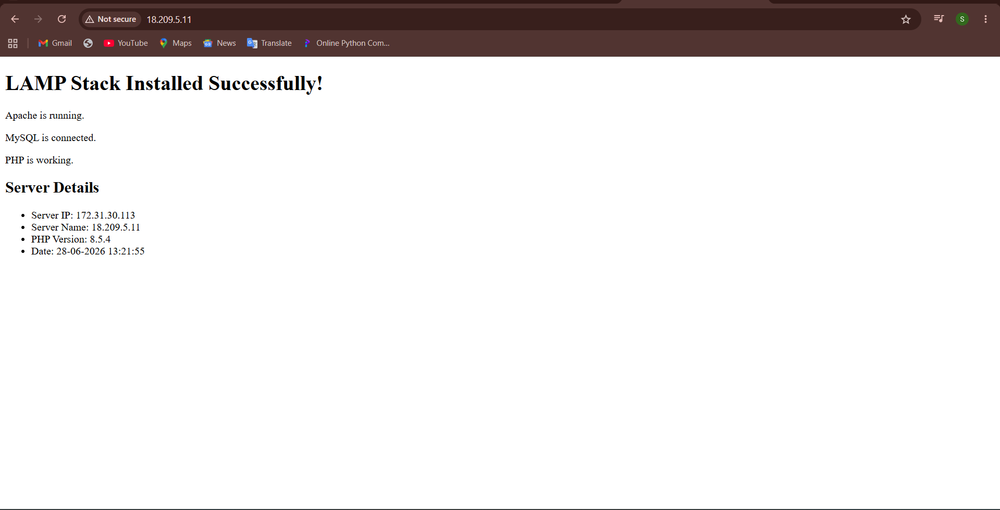

# LAMP Stack on AWS EC2

## Project Overview

This project demonstrates how to deploy a LAMP Stack (Linux, Apache, MySQL, PHP) on an AWS EC2 Ubuntu instance.

## Technologies Used

- AWS EC2
- Ubuntu 26.04
- Apache2
- MySQL
- PHP
- Git
- GitHub

## Steps Performed

- Launched an EC2 Ubuntu instance
- Connected using EC2 Instance Connect
- Updated system packages
- Installed Apache
- Installed MySQL
- Secured MySQL installation
- Installed PHP
- Verified PHP using phpinfo()
- Created a custom PHP homepage

## Verification

Apache

```bash
sudo systemctl status apache2
```

MySQL

```bash
sudo systemctl status mysql
```

PHP

```bash
php -v
```

## Project Structure

```text
lamp-stack-aws/
├── README.md
├── LICENSE
├── .gitignore
├── install_lamp.sh
├── index.php
└── screenshots/
```

## Screenshots

### Apache Running



### MySQL Version



### PHP Version



### PHP Info Page



### Web Root Files



### Custom PHP Page



## Author

Sajida Shaik